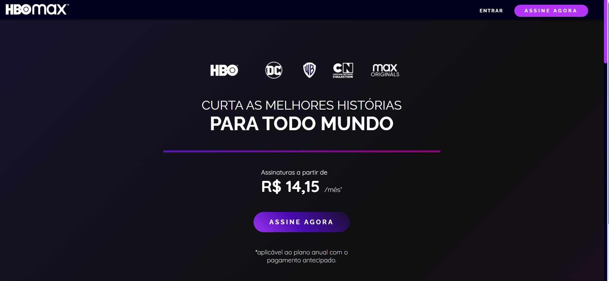
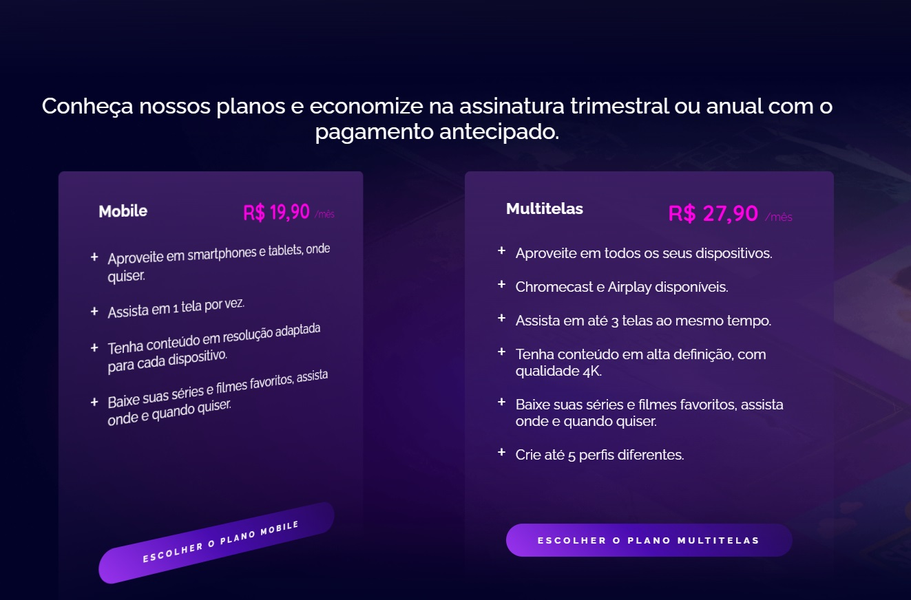
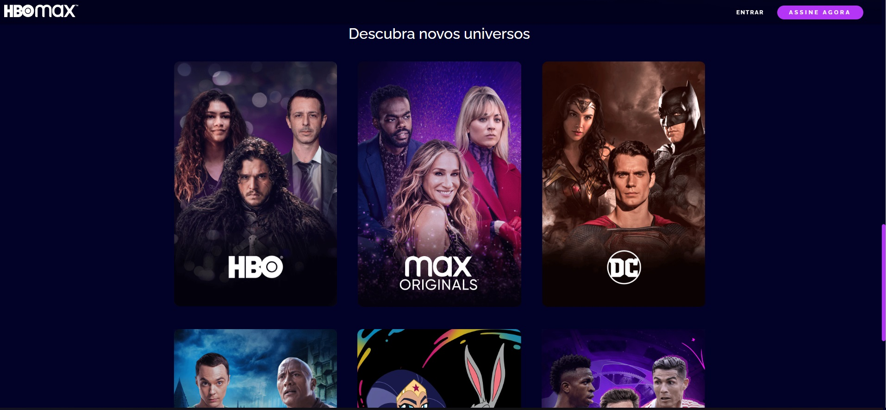

# 📌Clone HBO Max

O projeto consiste em um clone do site da HBO Max, desenvolvido com o objetivo de replicar sua interface, porém com algumas adaptações. A proposta é aplicar os conceitos de CSS abordados durante as aulas da plataforma Digital Innovation One (DIO).

Este desafio foi criado para que os alunos possam testar seus conhecimentos e praticar os recursos de HTML e CSS aprendidos nos cursos, consolidando o aprendizado por meio de um projeto realista.

 

 

 

 

## 📎 **Sumário**
- ⭐ Features
- 📂 Temas abordados
- 🏆 Desafio

 

## ⭐ **Features**

- Menu de navegação
- Cabeçalho com animação gradiente
- Cards com os planos de assinatura animados
- Lista de filmes e séries disponíveis na plataforma
- Formulário de login
- Rodapé com links importantes
- UI Responsiva

Este é um projeto puramente front-end, focado na reprodução da interface do HBO Max com customizações, sem consumo de APIs ou funcionalidades back-end.

 

## 📂 Temas abordados

Recursos CSS presentes no projeto:

- Fundamentos do CSS
- Grid Layout
- Flexbox
- Responsividade
- Pseudo-elementos
- Pseudo-classes
- Transformações 2D e 3D
- Transições e animações
- Tratamento de campos inválidos no formulário

 

## 🏆 Desafio

Este projeto aplica conceitos de CSS, incluindo:

- Animações e transições fluidas para melhor experiência do usuário
- Design responsivo com abordagem mobile-first
- Efeitos interativos em elementos UI
- Validação de formulários puramente com CSS
- Layouts complexos utilizando Grid Layout e Flexbox

 

